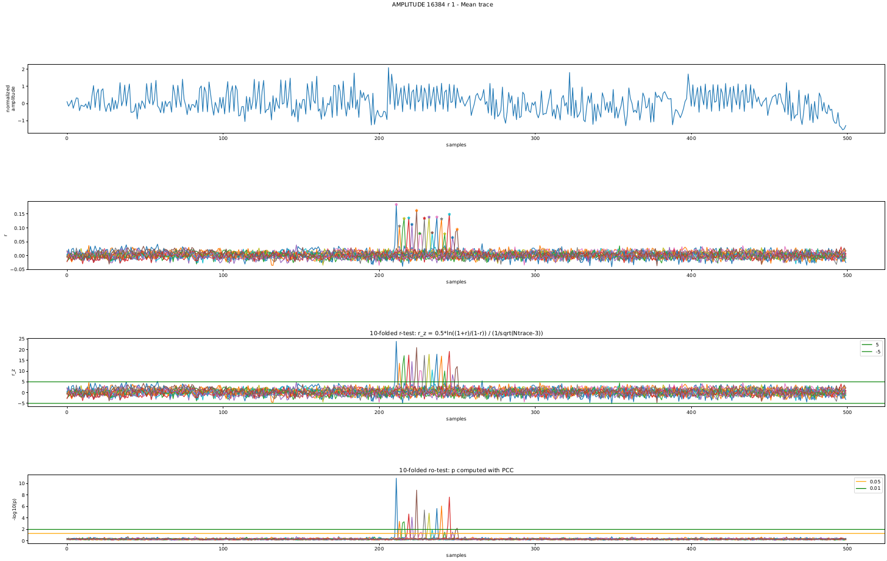
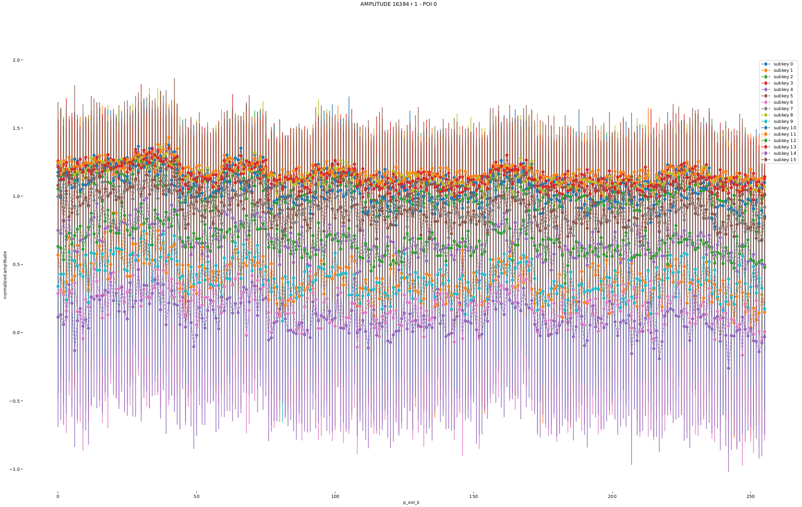
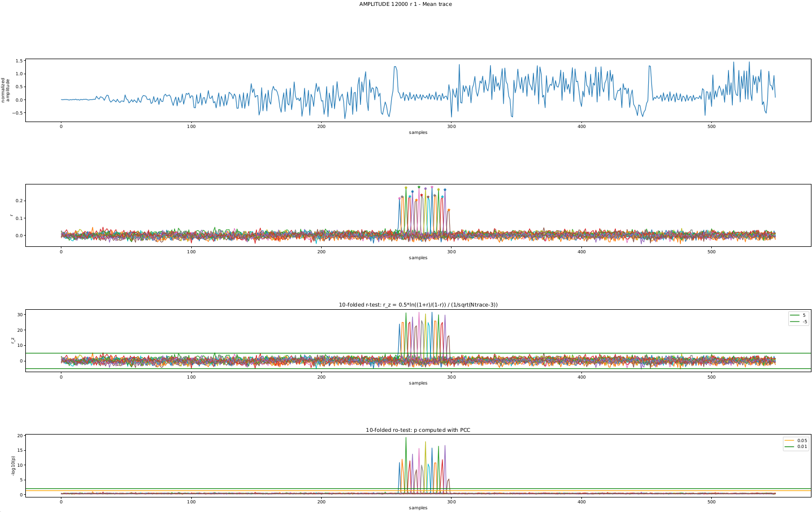
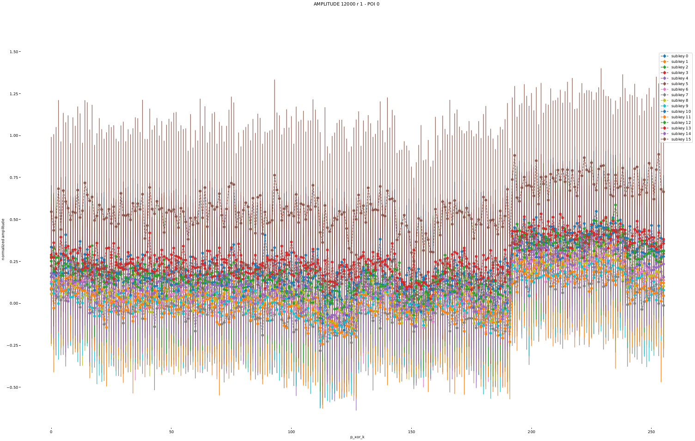

# Table of Contents

1.  [Abstract](#orge32dee9)
2.  [Overview](#orgc76ec46)
3.  [Setup](#org41c8ae4)
    1.  [Download](#orgaaeea2e)
    2.  [Installation](#org48ac013)
4.  [Reproducing the attacks](#org2273718)
    1.  [Attacking $A_{7}$](#org6bbdb8f)
    2.  [Attacking $A_{9}$](#orge3899b8)
5.  [Clean](#org60e38fc)
6.  [Conclusion](#org4c4502d)

# Abstract

This artifact consists of software and data to reproduce the main results of
section 8.5 of our paper. The software is composed of Python source code
and a C library. Everything is automated inside a Docker container, and
dependencies and manual installation are referenced under the main
project web page. The data mainly consists of Numpy arrays containing complex
numbers representing I/Q data.

# Overview

This guide will help you reproduce the main results of our paper. Note that
this is a small part of our project. The full project can be found on GitHub at
[`pierreay/screaming_channel_ble`](https://github.com/pierreay/screaming_channels_ble/). A web version of this guide can also be found
at [`screaming_channels_ble/docs/demo_20240828_acsac/README.org`](https://github.com/pierreay/screaming_channels_ble/tree/main/docs/demo_20240828_acsac/README.org). We have
published in open-access all of our data in the repository located at
[`pierreay/screaming_channels_data`](https://github.com/pierreay/screaming_channels_data/).

To fully reproduce this attack, one would have to first acquire a dataset by:

1.  Flashing two firmware (the attacker dongle and the victim board) and
    installing the radio tooling.
2.  Setup the experimental setup, including the attacker host computer, the
    radio, the antenna and amplifiers, the dongle, the victim dongle.
3.  Performing a dataset collection (up to several days).
4.  Post-processing the dataset to extract the small AES leak amplitude trace
    from the large RAW I/Q signal.

As you imagine, this is fairly complex and long without prior experience.
Hence, in this guide, we provides two representative pre-processed datasets on
which we can complete the second part of the attack. The $A_x$ refer to the
paper notation, while the long name refer to our data repository notation:

-   **$A_{7}$:** `240207_1-leak-pairing-10cm-anechoic-2.533e9-8e6_raw`
-   **$A_{9}$:** `240429_highdist_2lna_highgain_norep`

Hence, we uploaded two representative and small datasets on Zenodo:

> Ayoub (2024) Screaming Channels on Bluetooth Low Energy, Zenodo. DOI:
> 10.5281/zenodo.13384278. URL: <https://zenodo.org/records/13384278>

For both datasets, we will execute the following steps:

1.  Create a profile (*i.e.*, a template) from a training subset to learn the
    leakage model.
2.  Leveraging the profile, attack using a Template Attack on an attack subset.

While it is not mandatory, the [`docs/demo_20231014/README.org`](https://github.com/pierreay/screaming_channels_ble/blob/main/docs/demo_20231014/README.org) demo give a look
at visualizing how traces and the AES leakage looks like.

# Setup

First, we will setup necessary tools, downloading the code and the data.

## Download

Clone the "Screaming Channels on Bluetooth Low Energy" repository (~ 10 MB) in
the directory of your choice:

    git clone https://github.com/pierreay/screaming_channels_ble/

Moreover, manually download the two aforementioned datasets located at
[`zenodo.org/records/13384278`](https://zenodo.org/records/13384278) which have been publicly uploaded on Zenodo (less
than 2 GB).

## Installation

We will setup a temporary Docker container for reproducing the attacks. Ensure
that both [Docker](https://www.docker.com/) and its [buildx](https://docs.docker.com/build/concepts/overview/) builder are installed.

First, move the downloaded datasets inside the Docker folder:

    cd screaming_channels_ble/docs/demo_20240828_acsac
    mv -t . /PATH/TO/240207_1-leak-pairing-10cm-anechoic-2.533e9-8e6_raw.tar.bz2
    mv -t . /PATH/TO/240429_highdist_2lna_highgain_norep.tar.bz2

Second, download and initialize the Docker image leveraging the `Dockerfile`:

    make build

It will download around 2 GB and decompress the datasets that have been
downloaded previously inside the container. The image and containers will be
cleaned up at the end, no files will be left or modified on the host system.

If you get an error like the following one:

    cp: cannot stat '/host/*.tar.bz2': No such file or directory

It means that the two datasets archives were not moved correctly to the
Dockerfile directory and that the Docker container cannot access them.

# Reproducing the attacks

The Docker is now ready to be use. In the following, we assume that the reader
is connected to the Docker container through SSH:

    make shell

For the following command, the `$SC_SRC` variable is set to the path of the
`screaming_channels_ble/src` directory, while the `$DATASET` variable will be
set to the path of the currently analyzed dataset.

## Attacking $A_{7}$

This dataset correspond to the scenario with the non-instrumented firmware in
the anechoic box.

Set the path to the dataset:

    export DATASET="/240207_1-leak-pairing-10cm-anechoic-2.533e9-8e6_raw"

First, create the profile:

    "${SC_SRC}/attack.py" --dataset-path "${DATASET}" --custom-dtype --plot \
                          --save-images --norm --comptype AMPLITUDE \
                          --num-traces 16384 --start-point 1000 --end-point 1500 \
                          profile --pois-algo r --num-pois 1 --poi-spacing 1 \
                          --variable p_xor_k --align

Where non-obvious options means:

-   **&#x2013;custom-dtype:** Use a custom `dtype` instead of the default Numpy complex
    `dtype`, allowing to save disk space.
-   **&#x2013;norm:** Normalize the traces after loading.
-   **&#x2013;start-point / &#x2013;end-point:** Truncate the traces between those points.
-   **&#x2013;pois-algo:** Use the $k-\text{fold}$ $\rho-\text{test}$ to find informative
    point of interests (PoIs).
-   **&#x2013;num-pois:** Use only 1 PoI per subbytes.
-   **&#x2013;variable pxork:** Use the $l = p \oplus k$ leakage variable, with $p$ the
    plaintext and $k$ the key.

At that point, a plot should open (if X11 forwarding is correctly configured
with Docker) and the profile will be stored under `${DATASET}/profile`. If no
plot appears, check that the profile has correctly been created by running:

    evince ${DATASET}/profile/*.pdf

You should obtains plots similar to the following ones:

We will now attack using the created profile:

    "${SC_SRC}"/attack.py --dataset-path "${DATASET}" --custom-dtype --log \
               --plot --norm --bruteforce --comptype AMPLITUDE \
               --start-point 1000 --end-point 1500 --num-traces 14900 \
               attack --attack-algo pcc --profile "${DATASET}/profile" --num-pois 1 \
               --poi-spacing 1 --variable p_xor_k --align-attack --align-profile \
               --no-align-profile-avg

The options are fairly similar to the previous command, except that we also
specify to bruteforce the key at the end, and to re-perform a step of trace
alignment. You should see this output:

    Best Key Guess:   7c   19   67   e4   41   65   da   6d   f5   18   32   f7   c5   f1   13   3e
    Known Key:        7f   18   67   e6   42   65   da   6f   f5   1b   32   f4   c6   f3   10   3e
    PGE:             002  001  000  003  001  000  000  003  000  003  000  003  002  002  001  000
    HD:              002  001  000  001  002  000  000  001  000  002  000  002  002  001  002  000
    SUCCESS:           0    0    1    0    0    1    1    0    1    0    1    0    0    0    0    1
    CORRECT BYTES: 6
    PGE MEAN:      1
    PGE MEDIAN:    1
    PGE MAX:       3
    HD SUM:        16
    
    Starting key ranking using HEL
    results rank estimation
    nb_bins = 512
    merge = 2
    Starting preprocessing
    Clearing memory
    min: 2^33.79125918
    actual rounded: 2^34.59872304
    max: 2^35.23080812
    time enum: 0.343729 seconds

Which means that this attack leads to an estimated key rank of $2^{34}$, just
as $A_{7}$ in the paper.

With the additional bruteforce, which took 1,5 hours running natively on my
desktop computer but a little more inside the Docker container, you should
obtain:

    Starting key enumeration using HEL
    Assuming that we know two plaintext/ciphertext pairs
    [...]
    Starting preprocessing
    current rank : 2^2.584962501
    current rank : 2^4.459431619
    [...]
    current rank : 2^33.13069245
    current rank : 2^34.11663176
    
    KEY FOUND!!!
    7f 18 67 e6 42 65 da 6f f5 1b 32 f4 c6 f3 10 3e

Which means we break the entire key!

## Attacking $A_{9}$

This dataset correspond to the scenario with the non-instrumented firmware at a
distance of 1.2 meter in an office environment. Since the steps are similar to
the [previous attack](#org6bbdb8f), we will not detail the commands and options.

First, create the profile:

    export DATASET="/240429_highdist_2lna_highgain_norep/raw"

    "${SC_SRC}/attack.py" --dataset-path "${DATASET}" --custom-dtype --plot \
                          --save-images --norm --comptype AMPLITUDE \
                          --num-traces 12000 --start-point 1100 --end-point 1650 \
                          profile --pois-algo r --num-pois 1 --poi-spacing 1 \
                          --variable p_xor_k --align

    evince ${DATASET}/profile/*.pdf

You should obtains plots similar to the following ones:

Then, attack using the created profile:

    "${SC_SRC}"/attack.py --dataset-path "${DATASET}" --custom-dtype --log \
               --plot --norm --no-bruteforce --comptype AMPLITUDE \
               --start-point 1020 --end-point 1570 --num-traces 40000 \
               attack --attack-algo pcc --profile "${DATASET}/profile" --num-pois 1 \
               --poi-spacing 1 --variable p_xor_k --align-attack --align-profile \
               --no-align-profile-avg

You should see this output:

    Best Key Guess:   a3   e3   69   9c   a9   2a   3f   46   f4   5f   11   5c   78   80   a6   4f
    Known Key:        ad   ef   6d   92   a8   29   32   40   f4   56   17   52   79   8d   a6   46
    PGE:             006  001  014  005  002  005  008  010  000  007  011  003  006  004  000  010
    HD:              003  002  001  003  001  002  003  002  000  002  002  003  001  003  000  002
    SUCCESS:           0    0    0    0    0    0    0    0    1    0    0    0    0    0    1    0
    CORRECT BYTES: 2
    PGE MEAN:      5
    PGE MEDIAN:    5
    PGE MAX:       14
    HD SUM:        30
    
    Starting key ranking using HEL
    results rank estimation
    nb_bins = 512
    merge = 2
    Starting preprocessing
    Clearing memory
    min: 2^55.02283544
    actual rounded: 2^60.13102936
    max: 2^62.56824053
    time enum: 0.196843 seconds

Which means that this attack leads to an estimated key rank of $2^{60}$, just
as $A_{9}$ in the paper.

# Clean

Finally, once the Docker container is exited, one may run the following to
clean the image:

    make clean

# Conclusion

In this demonstration, we reproduced the two most important results of the
paper regarding attack performances. All other claims can also be reproduced by
leveraging our full dataset repository, including scripts and data. Regarding
the protocol manipulation part of the attack, a better solution would be to
have an online platform allowing to replicate and extend such attacks. We are
looking into this as future work.

